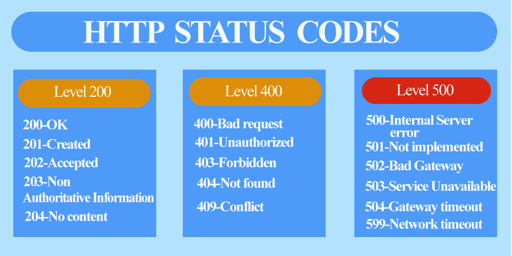
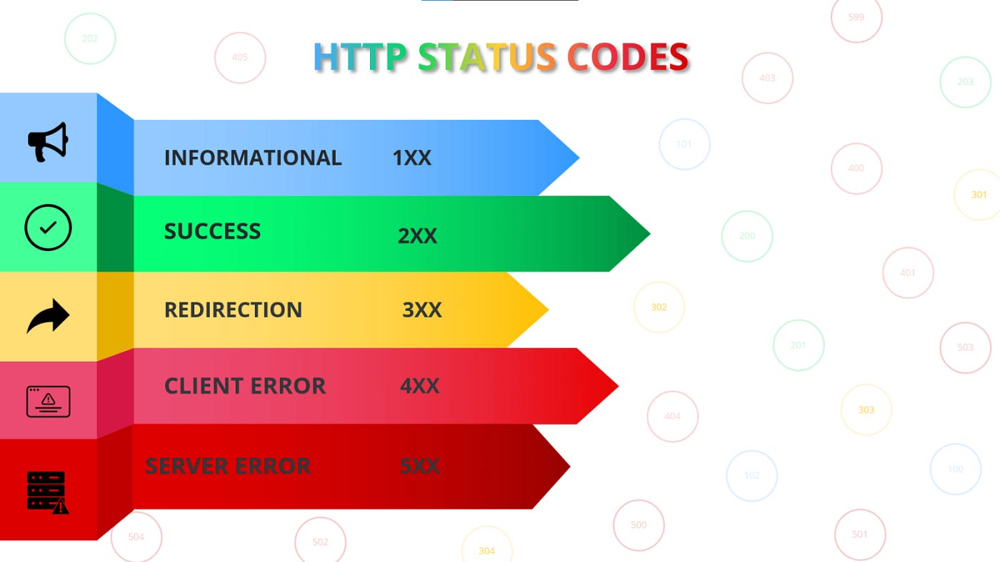

  

# HTTP response status codes
 They are standardized codes that a web server sends to a client (typically a web browser) to indicate the result of a client's request. 
 They indicate whether a specific HTTP request was successfully completed and they are grouped in five classes; 

## 1. Informational responses (100 – 199): 1XX 

They indicate that the request has been received and the server is continuing the process.

 

 <table> 
    <th>Code</th>
    <th>Role</th>
    <tr>
    <td>100</td>
    <td> Indicates that the client should continue the request / ignore the response if the request is already finished.
    </td>
    </tr>
    <tr>
    <td>101</td>
    <td>
    Indicates the protocol the server is being switched to.
    </td>
    </tr>
    <tr>
    <td>102</td>
    <td>
     Indicate that the server has received and is processing the request, but no response is available yet.
    </td>
    </tr>
    <tr>
    <td>103</td>
    <td>
     Used with the Link header, to let the user agent start preloading resources while the server prepares a response or preconnect to an origin from which the page will need resources.
    </td>
    </tr>
 </table>  

## 2. Successful responses (200 – 299): 2XX 

They indicate that the request was successfully received, understood, and accepted.

 

<table> 
    <th>Code</th>
    <th>Role</th>
    <tr>
    <td>200</td>
    <td>Mean request was successful.</td>
    </tr>
    <tr>
    <td>201</td>
    <td>Indicate request succeeded, and a new resource was created as a result. 
    </td>
    </tr>
    <tr>
    <td>202</td>
    <td>Indicate that the request has been received but not yet acted upon.
    </td>
    </tr>
    <tr>
    <td>203</td>
    <td>Means the returned metadata is not exactly the same as is available from the origin server, but collected from a local or third-party copy.
    </td>
    </tr>
    <tr>
    <td>204</td>
    <td>Indicates there is no content to send for this request.
    </td>
    </tr>
    <tr>
    <td>205</td>
    <td>Tell the user agent to reset the document which sent the request.
    </td>
    </tr>
    <tr>
    <td>206</td>
    <td>Used when the Range header is sent from the client to request only part of a resource.
    </td>
    </tr>
    <tr>
    <td>207</td>
    <td>Convey information about multiple resources, in situations where multiple status codes might be appropriate.
    </td>
    </tr>
    <tr>
    <td>208</td>
    <td>Convey information about multiple resources, in situations where multiple status codes might be appropriate.
    </td>
    </tr>
</table>  

  

## 3. Redirection messages (300 – 399)  3XX

They indicate that further action is needed to complete the request, usually involving redirection.

 

<table> 
    <th>Code</th>
    <th>Role</th>
    <tr>
    <td>301</td>
    <td>Indicate that the resource has been permanently moved to a new URL.</td>
    </tr>
    <tr>
    <td>302</td>
    <td>Indicate that a resource is temporarily available at a different URL. 
    </td>
    </tr>
    <tr>
    <td>303</td>
    <td>Indicate that the response to the request can be found at another URL using a GET method. 
    </td>
    </tr>
    <tr>
    <td>304</td>
    <td>Indicate that the resource has not been modified since the last request. 
    </td>
    </tr>
</table>  

## 4. Client error responses (400 – 499)  4XX

They indicate that there was an error with the client's request.

 

<table> 
    <th>Code</th>
    <th>Role</th>
    <tr>
    <td>400</td>
    <td>Indicate that the server could not understand the request due to invalid syntax.</td>
    </tr>
    <tr>
    <td>401</td>
    <td>Indicate that authentication is required, and the client must provide credentials.
    </td>
    </tr>
    <tr>
    <td>403</td>
    <td>Indicate that the client does not have permission to access the requested resource.
    </td>
    </tr>
    <tr>
    <td>404</td>
    <td>Indicate that the requested resource could not be found on the server.
    </td>
    </tr>
    <tr>
    <td>405</td>
    <td>Indicate that the request method is not supported for the requested resource.
    </td>
    </tr>
    <tr>
    <td>409</td>
    <td>Indicate that the  request could not be completed due to a conflict with the current state of the resource.
    </td>
    </tr>
    <tr>
    <td>429</td>
    <td>Indicate that the client has sent too many requests in a given amount of time (rate limiting).
    </td>
    </tr>
</table> 

## 5. Server error responses (500 – 599)  5XX

They indicate that the server encountered an error and could not complete the request.

 

<table> 
    <th>Code</th>
    <th>Role</th>
    <tr>
    <td>500</td>
    <td>Indicate that the server encountered an unexpected condition that prevented it from fulfilling the request.</td>
    </tr>
    <tr>
    <td>501</td>
    <td>Indicate the server does not support the functionality required to fulfill the request.
    </td>
    </tr>
    <tr>
    <td>503</td>
    <td>Indicate that the server is currently unable to handle the request due to temporary overload or maintenance.
    </td>
    </tr>
    <tr>
    <td>504</td>
    <td>Indicate that the server did not receive a timely response from an upstream server.
    </td>
    </tr>
</table> 

 
 

This is a Summary of most common HTTP response status codes. To find more you can read through the below link.  

_All Credit Goes To [MDN WEB DOCS](https://developer.mozilla.org/en-US/docs/Web/HTTP/Status)_
